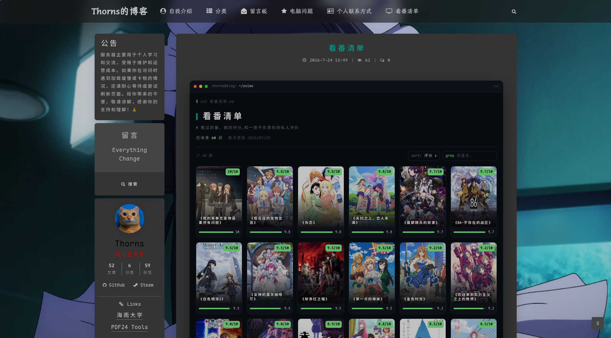

# Bangumi List 看番清单

一个给 WordPress 加「看番清单」页面的独立插件:后台像写文章一样记录看过的番(封面 / 评分 / 评语),前台用**终端风海报网格**展示,风格与博客文章完全隔离。

> A WordPress plugin that adds a terminal-styled anime watch-list page. Manage entries in wp-admin, render anywhere with the `[anime_list]` shortcode.



<p align="center"><sub>前台效果 · 短代码 <code>[anime_list]</code> · 图为 <a href="https://thornsw.cn/anime">thornsw.cn/anime</a></sub></p>

## 特性

- 注册「动漫」内容类型(CPT `anime`),后台增删改,自带列表 / 编辑界面(特色图当封面)
- 每部番:番名、封面、评分(自由文本,如 `9.7/10`,也能写"神作"这种)、评语、观看方式、Bangumi 链接
- 前台短代码 `[anime_list]`:终端窗口外壳 + 海报网格,评分徽章 + 进度条,悬停(桌面)/ 点按(移动)看评语
- 前端搜索(番名)+ 按评分 / 最近添加排序,纯 JS,无需翻页
- 封面可自动抓取(mikan / Bangumi,带比例校验挡掉横版图),或后台手动上传;抓不到自动用「文字卡」占位
- 样式作用域化(`.bgm-*`),不污染主题;复用等宽字体(推荐 Maple Mono NF CN)
- 标题、副标题、终端用户名、主题色均可通过短代码属性自定义

## 要求

- WordPress 5.8+
- PHP 7.4+
- (可选)WP-CLI —— 用于批量导入 / 自动抓封面

## 安装

### 推荐:下载 Release

去 **[Releases](https://github.com/ThornsW/bangumi-list/releases/latest)** 下载 `bangumi-list-x.y.z.zip`,后台「插件 → 安装插件 → 上传插件」选它,**无需改名**。

> ⚠️ 别用 Release 页面上的「Source code (zip)」,也别用仓库主页绿色按钮的「Download ZIP」—— 那两个解压出来分别是 `bangumi-list-x.y.z/` 和 `bangumi-list-main/`,目录名不对。

### 从源码安装

插件目录必须叫 `bangumi-list`,否则和文档、日后的更新机制对不上。

```bash
# 方式 A:git clone(目录名天然正确)
cd wp-content/plugins/
git clone https://github.com/ThornsW/bangumi-list.git

# 方式 B:下载源码 zip 后改名
cd wp-content/plugins/
unzip ~/bangumi-list-main.zip
mv bangumi-list-main bangumi-list
```

### 装好之后

1. 后台「插件」启用 **Bangumi List 看番清单**
2. 新建一个页面,内容写上短代码 `[anime_list]`,发布(建议用全宽 / 空白页面模板)
3. 后台左侧「看番」里添加番剧,设置「特色图」当封面

## 短代码用法

`[anime_list]`,可选属性:

| 属性 | 说明 | 默认 |
|---|---|---|
| `title` | 页面大标题 | `看番清单` |
| `subtitle` | 副标题一行 | `# 记录看过的番、我的评分与短评` |
| `handle` | 终端标题栏用户名 | `user@blog` |
| `path` | 终端路径标签 | `~/anime` |
| `accent` | 主题强调色(hex) | `#7ee787` |

例:`[anime_list title="我的番剧" handle="me@site" accent="#22d3ee"]`

## 批量导入(WP-CLI)

JSON 格式(见 `examples/sample-anime.json`):

```json
[{ "title": "番名", "rating": "9.7/10", "review": "评语", "watch_mode": "常规" }]
```

导入:

```bash
wp bangumi import /path/to/anime.json
```

- 幂等:按番名判重,重复执行安全
- 自动跳过"没看成"条目(评分和评语都空,或含「看不了 / G了」)
- 从 Excel 转 JSON 可参考 `examples/xlsx_to_json.py`

## 封面

三种方式,按推荐度排列。

### 1. 本机抓好再入库(覆盖率和画质最好)

`tools/fetch-covers-local.py` 在你自己的机器上跑 —— **mikan 优先、bgm 兜底**,产出图片目录和
`manifest.json`,再传到服务器入库。适合服务器网络受限的情况(比如连不通 mikanani.me)。

只依赖 Python 3 标准库,不用装 requests / Pillow。

```bash
# ① 服务器上导出番名列表
wp post list --post_type=anime --post_status=publish \
   --format=json --fields=ID,post_title > anime-list.json

# ② 本机抓图(HTTP(S)_PROXY 环境变量会被自动采用,也可 --proxy 显式指定)
python3 tools/fetch-covers-local.py anime-list.json -o covers/

# ③ 回传并入库(源文件只读不删,可反复跑)
scp -r covers/ vps:/tmp/covers
ssh vps 'wp bangumi import-covers /tmp/covers'
```

`import-covers` 支持 `--dry-run` 先看会做什么、`--overwrite` 覆盖已有封面。

抓取端会做两道过滤,结果都写进 `manifest.json` 备查:

- **比例闸**(默认宽/高 `0.5–0.8`):挡掉横版主视觉图,见下方「关于比例闸」
- **标题比对**:搜索结果和番名对不上的跳过;若某图源只返回唯一一条结果,则收下但标记
  `low_confidence`,并在结尾单独列出来提醒你核对(各站译名常常不同,例如「金色时光」
  在 mikan 叫「青春纪行」)

常用开关:`--source mikan|bgm|both`、`--limit N`、`--ratio-min/--ratio-max`、`--min-width`、
`--delay`(请求间隔,默认 0.8s,低于 0.3s 会被强制抬回)、`--proxy`。中断后重跑会自动跳过已抓到的。

**开跑前会先探一次图源**(约 10 秒):连不通的自动禁用,两个都不通就直接报错退出并提示配代理 ——
不加这道探测的话,图源被墙时 60 部要空转约两小时且一无所获。确实要跳过就加 `--no-preflight`。

### 用之前要知道的几个限制

- **网络**:`mikanani.me`、`api.bgm.tv` 在不少网络环境下需要代理。用 `--proxy http://127.0.0.1:7890`
  或设 `HTTPS_PROXY` 环境变量。
- **译名不一致会误判**:各站中文译名常常不同(「金色时光」在 mikan 叫「青春纪行」)。脚本对
  「某图源只返回唯一一条结果」的情况会放宽标题门槛并标 `low_confidence`,**结尾会单独列出来 ——
  务必过一眼**。实测确实出现过张冠李戴(「嗜血狂袭」匹配到无关的「翡翠森林狼与羊」)。
- **繁体标题**:不做繁简转换,繁体番名可能匹配不上,手动改成简体再跑即可。
- **标题带自加后缀**:`第一季`/`系列`/`一二季`/`-电影` 会自动剥离后重搜;但清单里的错别字
  (如「掘与宫村」应为「堀」)只能自己改。
- **抓不到不会破坏现状**:MISS 的条目 `import-covers` 会跳过,原有封面保持不动。
- **媒体库会累积**:导入生成新附件,被替换掉的旧图仍留在媒体库里(方便回滚),需要的话自行清理。
- 需要 **Python 3.7+**,只用标准库。

### 2. 服务器直抓(需能访问 `api.bgm.tv`)

```bash
wp bangumi fetch-covers --limit=10     # 先试 10 部,核对匹配
wp bangumi fetch-covers                # 全部
wp bangumi fetch-covers --overwrite    # 连已有封面也重抓
```

同样会逐个试搜索结果、过比例闸,第一个合格的才收下。封面下载进你的媒体库(不盗链),
匹配不到的保持文字卡占位。

> ⚠️ 部分服务器(尤其某些地区的云主机)可能因 DNS 污染 / 网络原因访问不到 `api.bgm.tv`,
> 此时 `fetch-covers` 会全部 MISS,请改用方式 1 或方式 3。

### 3. 手动

后台编辑番 → 设「特色图」。

### 关于比例闸

前台海报框是固定的 3:4 + `object-fit:cover`,横版图进去会被裁掉一半宽度,看起来就像「比例失调」。

而 bgm 的 `type=2` 是全库搜索,除番剧本体外还混着「特别纪念动画」「联动 PV」这类条目,
它们的封面是**横版主视觉**。实测约 4–5% 的搜索结果是这种图(宽/高 1.41、1.59),
而正规竖版海报集中在 **0.707**(√2/2),区间 0.659–0.756 —— 两者之间空档很宽,
所以默认闸门取 `0.5–0.8` —— 上限压到 0.8 是为了同时挡住另一类更隐蔽的坏图:**蓝光碟盒封扫描**接近正方形(实测 0.854),不是横版却和满屏 0.707 的海报明显违和。

需要放宽或收紧:

```php
// 例:允许接近正方形的封面
add_filter('bangumi_list_cover_ratio_range', fn() => [0.5, 1.05]);
// 封面最小宽度(默认 200px,用于挡掉 bgm 的 150px 缩略图兜底)
add_filter('bangumi_list_cover_min_width', fn() => 300);
```

本机脚本对应 `--ratio-min` / `--ratio-max` / `--min-width`。

## 自定义

- **字体**:默认等宽字体栈(首选 Maple Mono NF CN)。想统一观感,可在主题里自托管该字体。
- **抓取 User-Agent**:默认取站点地址,可用过滤器 `bangumi_list_user_agent` 覆盖。
- **封面比例 / 尺寸门槛**:过滤器 `bangumi_list_cover_ratio_range`、`bangumi_list_cover_min_width`,见上方「关于比例闸」。
- **配色 / 文案**:见上方短代码属性。

## 数据模型

CPT `anime` + post meta:`_bgm_rating_text`(评分文本)、`_bgm_rating_value`(解析出的数字,排序用)、`_bgm_review`(评语)、`_bgm_watch_mode`(观看方式,前台不显示)、`_bgm_url`(bgm 链接)。

## 注意

- 站点若用了页面缓存(如 WP Fastest Cache),前端改动后记得清缓存。
- 「观看方式」仅后台保留,前台默认不显示不筛选。
- **未做 i18n**:前台文案是硬编码简体中文(`zsh`、`已收录 N 部`、`· 待配封面 ·` 等)。
  要改成其它语言,直接编辑 `includes/render.php` 和 `assets/anime.js` 里的字符串即可 ——
  注意排序按钮的文案在这两个文件里**各有一份**,只改一处会不一致。

## 致谢

番剧数据与封面来自 [Bangumi 番组计划](https://bgm.tv) 与 [蜜柑计划](https://mikanani.me)。
bgm 走官方 API,mikan 无公开接口故解析其搜索页。两边都是公益站点,抓取脚本默认 0.8s
间隔限流(低于 0.3s 会被强制抬回),**请勿调低**。

封面图著作权归各自版权方所有。本工具只是代为下载到你自己的媒体库(不盗链、不转售),
适用于个人博客展示看番记录;请勿用于商业用途。

## 许可证

GPL-2.0-or-later,详见 [LICENSE](LICENSE)。
